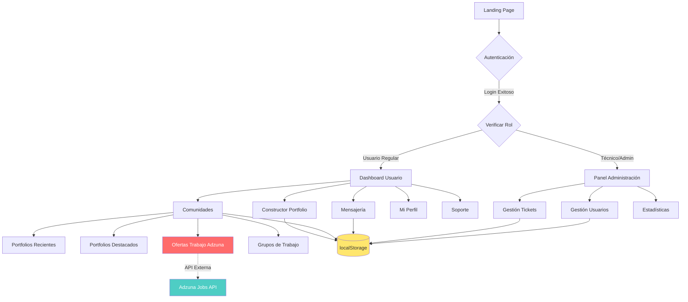
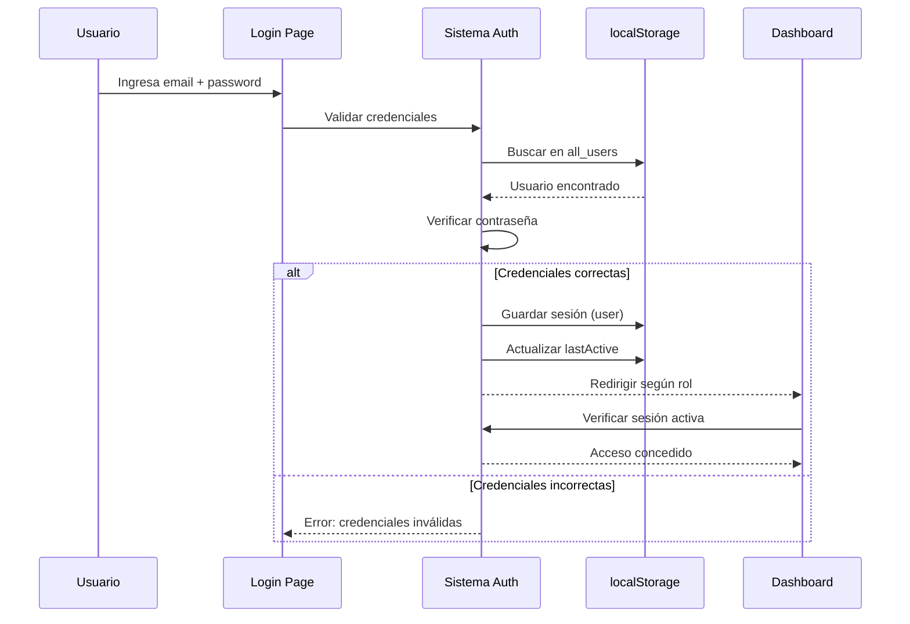
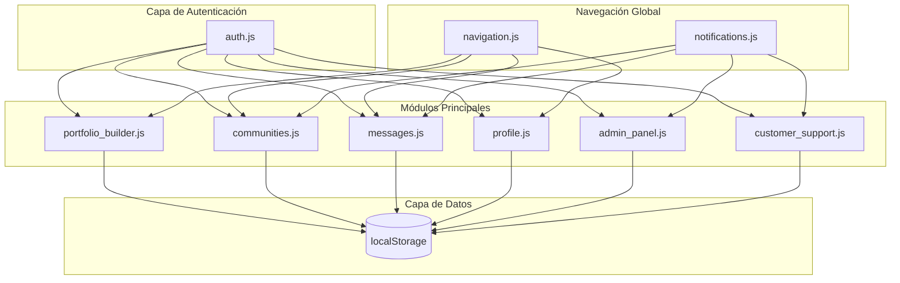
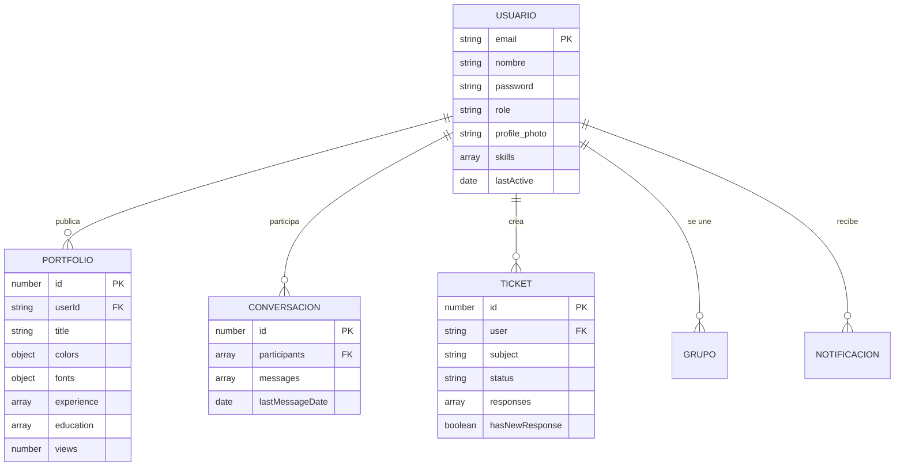

# 📁 DevFolio - Plataforma de Gestión de Portfolios Profesionales

> 📄 **[Documentación Técnica Completa (PDF)](./assets/pdf/Documentación%20Técnica%20DevFolio.pdf)**

---

## 📑 Índice de Contenidos

1. [Introducción](#-introducción)
2. [Tecnologías Utilizadas](#-tecnologías-utilizadas)
3. [Arquitectura del Sistema](#-arquitectura-del-sistema)
4. [Base de Datos](#-base-de-datos-localstorage)
5. [Funcionalidades Principales](#-funcionalidades-principales)
6. [Desafíos Técnicos](#-desafíos-técnicos-superados)
7. [Instalación](#-instalación-y-configuración)
8. [Guía de Usuario](#-guía-de-usuario)
9. [Presentación del Proyecto](#-puntos-clave-para-presentación)

---

## 🎯 Introducción

**DevFolio** es una aplicación web completa que permite a profesionales crear, publicar y compartir sus CV digitales de forma interactiva. La plataforma integra múltiples funcionalidades:

### ¿Qué hace DevFolio?

- **Crea portfolios profesionales** personalizados con constructor visual
- **Comparte tu CV** con la comunidad profesional
- **Descubre ofertas de trabajo reales** de empresas en España
- **Conecta con otros profesionales** mediante mensajería directa
- **Únete a grupos de trabajo** por tecnologías (React, Vue, Angular...)
- **Gestión administrativa completa** para control del sistema

### ¿Por qué es especial?

✅ **Frontend puro** - No requiere backend ni servidor de base de datos  
✅ **Datos reales** - Integra API externa para ofertas de trabajo  
✅ **Sistema completo** - Desde autenticación hasta panel de administración  
✅ **Roles multinivel** - Permisos diferenciados para usuarios, técnicos y administradores  

---

## 🛠️ Tecnologías Utilizadas

### Stack Principal

| Tecnología | Uso | ¿Por qué? |
|------------|-----|-----------|
| **HTML5** | Estructura semántica | Base sólida y accesible |
| **CSS3** | Diseño responsive | Grid, Flexbox, animaciones |
| **JavaScript (Vanilla)** | Lógica completa | Sin dependencias, código puro |
| **localStorage** | Persistencia de datos | Base de datos del lado del cliente |
| **Adzuna API** | Ofertas de trabajo | Datos reales de empleos IT |

### Características Técnicas

- ✅ **Single Page Application (SPA)** con navegación fluida
- ✅ **Mobile-First Design** adaptable a cualquier dispositivo
- ✅ **Sin frameworks** - JavaScript puro para máximo control
- ✅ **Sin backend** - Funciona 100% en el navegador
- ✅ **Compatible** con todos los navegadores modernos

---

## 🏗️ Arquitectura del Sistema

### Diagrama General de la Aplicación



### Flujo de Autenticación



### Estructura de Componentes



---

## 💾 Base de Datos (localStorage)

### ¿Cómo funciona la persistencia sin backend?

DevFolio utiliza **localStorage del navegador** como sistema de base de datos completo. Esto significa que todos los datos se guardan localmente en el equipo del usuario.

### Diagrama de Relaciones entre Datos



### Estructura de Almacenamiento

| Clave en localStorage | Qué almacena | Tipo de dato |
|----------------------|--------------|--------------|
| `user` | Usuario actualmente autenticado | Object único |
| `all_users` | Todos los usuarios registrados | Array de objetos |
| `published_portfolios` | Portfolios publicados por los usuarios | Array de objetos |
| `support_tickets` | Tickets de soporte técnico | Array de objetos |
| `conversations` | Conversaciones de mensajería | Array de objetos |
| `custom_groups` | Grupos de trabajo creados | Array de objetos |
| `joined_groups` | Membresías a grupos | Array de objetos |
| `notifications` | Notificaciones del sistema | Array de objetos |
| `admin_logs` | Registro de acciones administrativas | Array de objetos |

### Ventajas y Limitaciones

#### ✅ Ventajas
- **No requiere servidor** - Funciona completamente offline
- **Rapidez** - Acceso instantáneo a los datos
- **Simplicidad** - No hay configuración de base de datos
- **Portabilidad** - Los datos viajan con el usuario

#### ⚠️ Limitaciones
- **Límite de tamaño** - Aproximadamente 5-10MB por dominio
- **Solo local** - Los datos no se sincronizan entre dispositivos
- **Seguridad básica** - Los datos son visibles en el navegador
- **Sin consultas complejas** - Se procesan datos manualmente con JavaScript

---

## ⚙️ Funcionalidades Principales

### BLOQUE 1: Sistema de Autenticación y Roles

#### 🔐 Autenticación de Usuarios

**¿Cómo funciona el login?**

1. El usuario ingresa email y contraseña
2. El sistema busca el email en `all_users` (localStorage)
3. Se verifica que la contraseña coincida
4. Si es correcto, se guarda la sesión en `user`
5. Se actualiza la fecha de última actividad (`lastActive`)
6. Se redirige al dashboard correspondiente según el rol

**Registro de nuevos usuarios:**

- Formulario con validación de campos
- Email único (no se permiten duplicados)
- Contraseña mínimo 6 caracteres
- Asignación automática de rol "user"
- Creación de perfil inicial vacío

#### 🎭 Sistema de Roles (3 niveles)

| Rol | Permisos | Acceso a |
|-----|----------|----------|
| **User** | Estándar | Portfolio, Communities, Mensajes, Perfil, Soporte |
| **Técnico** | Extendido | Todo lo de User + Panel Admin básico |
| **Admin** | Completo | Todo el sistema + Gestión total |

**¿Cómo se controla el acceso?**

Cada página protegida verifica la sesión al cargar:
- Si no hay usuario autenticado → Redirige a login
- Si el rol no es suficiente → Redirige al dashboard
- Si todo es correcto → Permite el acceso

---

### BLOQUE 2: Constructor de Portfolio Interactivo

#### 📝 ¿Qué es el Portfolio Builder?

Es un editor visual dividido en **2 paneles**:

**Panel Izquierdo (Editor):**
- Formularios para editar contenido
- Selectores de colores
- Selector de fuentes
- Gestión de secciones

**Panel Derecho (Preview):**
- Vista previa en tiempo real
- Muestra exactamente cómo se verá el CV
- Se actualiza al instante con cada cambio

#### 🎨 Personalización Visual

**Colores personalizables (5):**
1. Color primario
2. Color secundario
3. Color de acento
4. Color de fondo
5. Color de texto

**Fuentes de Google Fonts:**
- Fuente para títulos
- Fuente para cuerpo de texto
- Más de 20 opciones disponibles

#### 📋 Secciones del Portfolio

1. **Información Personal**
   - Nombre, email, teléfono
   - Título profesional
   - Foto de perfil

2. **Sobre Mí**
   - Descripción personal
   - Bio profesional

3. **Objetivo Profesional**
   - Qué buscas en tu carrera
   - Aspiraciones

4. **Experiencia Laboral**
   - Empresa, Puesto, Fechas
   - Descripción de responsabilidades
   - Múltiples trabajos

5. **Educación**
   - Institución, Título, Fechas
   - Descripción de estudios
   - Múltiples títulos

6. **Habilidades (Skills)**
   - Lista de tecnologías/competencias
   - Importadas desde el perfil

7. **Proyectos**
   - Nombre, Descripción, Link
   - Múltiples proyectos

8. **Idiomas**
   - Idioma y nivel de dominio

#### 🔄 Vinculación con Perfil

El constructor puede **importar datos automáticamente** del perfil del usuario:
- Experiencia laboral guardada
- Educación registrada
- Skills añadidos en el perfil
- Información personal

Esto evita tener que escribir todo desde cero.

#### 📤 Publicación

Cuando el portfolio está listo:
1. Se genera un objeto completo con todos los datos
2. Se guarda en `published_portfolios`
3. Se asigna un ID único
4. Se registra fecha de publicación
5. Aparece automáticamente en Communities

---

### BLOQUE 3: Sistema de Comunidades

#### 👥 ¿Qué son las Comunidades?

Es el espacio social de DevFolio con **4 secciones principales**:

#### 📂 1. Portfolios Recientes

**¿Qué muestra?**
- Todos los portfolios publicados
- Ordenados por fecha (más recientes primero)
- Vista en tarjetas con preview

**Funcionalidades:**
- Click para ver portfolio completo en modal
- Contador de vistas (se incrementa al abrir)
- Botón para enviar mensaje al autor
- Tags del portfolio

#### ⭐ 2. Portfolios Destacados

**¿Qué muestra?**
- Portfolios con más vistas
- Solo los que tienen al menos 1 vista
- Ordenados por popularidad

**Diferencia con Recientes:**
- Criterio de ordenación (vistas vs. fecha)
- Solo muestra los exitosos
- Fomenta la competencia sana

#### 💼 3. Ofertas de Trabajo (Adzuna API)

**⭐ LA CARACTERÍSTICA MÁS DESAFIANTE DEL PROYECTO ⭐**

**¿Qué es Adzuna?**

Adzuna es un motor de búsqueda de empleo que agrega ofertas de miles de fuentes. DevFolio integra su API para mostrar **trabajos reales de IT/Programación en España**.

**¿Cómo funciona la integración?**

1. **Configuración de credenciales:**
   - App ID: `141e0cfe`
   - API Key: `87c8f24eeb70fb73a397564f62ffa0ca`
   - Endpoint: `api.adzuna.com/v1/api/jobs/es/search`

2. **Filtrado automático:**
   - País: España (código `es`)
   - Categoría: IT jobs (código `it-jobs`)
   - Resultados por página: 20 ofertas

3. **Filtros del usuario:**
   - **Palabra clave** - Ej: "JavaScript", "React", "Senior Developer"
   - **Ubicación** - Ej: "Madrid", "Barcelona", "Remoto"

4. **Proceso de búsqueda:**
   - Usuario ingresa filtros opcionales
   - Se construye URL con parámetros
   - Se hace petición a la API (async/await)
   - Se reciben trabajos en formato JSON
   - Se muestran en tarjetas visuales

5. **Información de cada oferta:**
   - Título del puesto
   - Empresa que contrata
   - Ubicación
   - Descripción breve
   - Rango salarial (si disponible)
   - Link directo a la oferta completa

6. **Al hacer click:**
   - Se abre la oferta completa en nueva pestaña
   - Lleva al sitio de Adzuna
   - Ahí puede aplicar directamente

**Desafíos superados:**
- ✅ Primera vez integrando API externa real
- ✅ Manejo de autenticación con credenciales
- ✅ Construcción dinámica de URLs
- ✅ Manejo de respuestas asíncronas
- ✅ Estados de UI (loading, error, vacío)
- ✅ CORS y limitaciones de API
- ✅ Rate limits (500 llamadas/mes en tier gratuito)

#### 🏢 4. Grupos de Trabajo

**¿Qué son los Grupos?**

Comunidades temáticas donde profesionales de la misma tecnología comparten y colaboran.

**Tipos de grupos:**

1. **Predefinidos (3):**
   - React Developers
   - Vue.js Community
   - Angular Developers

2. **Personalizados:**
   - Los usuarios pueden crear sus propios grupos
   - Ej: "Node.js Experts", "Python Lovers", etc.

**Funcionalidades de los Grupos:**

- **Unirse/Salir**: Membresía libre
- **Ver Miembros**: Solo si eres miembro (privacidad)
- **Anunciar Portfolio**: Comparte tu CV con el grupo
- **Discusiones**: Crear hilos de conversación
- **Subir Posts**: Comparte contenido relevante

---

### BLOQUE 4: Sistema de Mensajería

#### 💬 Mensajería Directa entre Usuarios

**¿Cómo funciona?**

- Conversaciones privadas 1 a 1
- Sin grupos (por ahora)
- Ordenadas por última actividad

**Características:**

1. **Nueva Conversación:**
   - Modal con buscador de usuarios
   - Filtra por nombre o email
   - Selecciona destinatario
   - Escribe primer mensaje

2. **Lista de Conversaciones:**
   - Muestra todas tus conversaciones activas
   - Última mensaje visible
   - Timestamp relativo ("hace 2h")
   - Badge de mensajes no leídos

3. **Chat Individual:**
   - Historial completo de mensajes
   - Tu perfil vs. perfil del otro usuario
   - Input de mensaje
   - **Selector de emojis** integrado
   - Scroll automático al último mensaje

4. **Emojis:**
   - Picker visual
   - Categorías organizadas
   - Click para insertar
   - Unicode completo

5. **Estados:**
   - Leído / No leído
   - Indicador visual
   - Badge de contador

---

### BLOQUE 5: Panel de Administración

#### 🛡️ Acceso Restringido

**¿Quién puede acceder?**
- Solo usuarios con rol `admin` o `tecnico`
- Auto-redirige si intentas entrar sin permisos
- Muestra nombre de usuario y badge de rol

#### 🎫 Gestión de Tickets de Soporte

**¿Qué ve el Admin?**

**Dashboard de tickets:**
- Lista de TODOS los tickets del sistema
- Filtros por estado (Todos, Abiertos, En Progreso, Cerrados)
- Información resumida:
  - ID del ticket
  - Usuario que lo creó
  - Asunto
  - Prioridad (Baja, Media, Alta, Urgente)
  - Estado actual
  - Fecha de creación

**Vista detallada de ticket:**

Al hacer click en un ticket:
1. **Información completa:**
   - Todos los datos del usuario
   - Categoría (Técnico, Cuenta, Billing, etc.)
   - Descripción completa del problema

2. **Historial de respuestas:**
   - Todas las respuestas anteriores
   - Quien respondió (nombre del admin)
   - Fecha y hora de cada respuesta
   - Texto completo

3. **Responder:**
   - Textarea para escribir respuesta
   - Selector para cambiar estado
   - Botón "Enviar Respuesta"

4. **¿Qué pasa al responder?**
   - Se agrega respuesta al array `responses`
   - Se cambia el estado del ticket si se seleccionó
   - Se marca `hasNewResponse = true` para el usuario
   - Se guarda todo en localStorage
   - El usuario ve un **badge "Nueva respuesta"** 🟢

**Sincronización con Usuario:**

Este es uno de los aspectos técnicos más interesantes:

1. Admin responde ticket → Se guarda en `support_tickets`
2. Se activa flag `hasNewResponse`
3. Usuario entra a Customer Support → Ve badge verde
4. Usuario abre ticket → Ve todas las respuestas del equipo
5. Al abrir, se marca automáticamente como leído
6. Badge desaparece

#### 👥 Gestión de Usuarios

**Tabla completa de usuarios:**

Columnas:
- Nombre
- Email
- **Rol (dropdown modificable)**
- Fecha de registro
- Acciones

**Cambiar rol de usuario:**

- Dropdown con 3 opciones: User, Técnico, Admin
- Al cambiar, se guarda instantáneamente
- **Protección**: No puedes cambiar tu propio rol
- Se registra en `admin_logs` (auditoría)
- Toast de confirmación

**Restablecer contraseña:**

- Botón por cada usuario (sin emoji 📧)
- Abre modal profesional
- Campos:
  - Email destino (auto-llenado)
  - Mensaje personalizado (opcional)
- Botón "Enviar Email"
- **Simulación**: No envía email real (no hay SMTP)
- Se registra la acción en logs
- Toast de confirmación

**Buscador de usuarios:**

- Input de búsqueda
- Filtra en tiempo real
- Por nombre O email
- Actualiza tabla automáticamente

#### 📊 Reportes y Estadísticas

**Dashboard en Tiempo Real:**

Todas las estadísticas se **calculan dinámicamente** desde localStorage cada vez que cargas la página.

**Tarjetas superiores (4):**

1. **Total Usuarios**
   - Cuenta usuarios en `all_users`
   - Mínimo 1 (el actual)

2. **Tickets Abiertos**
   - Cuenta tickets con status ≠ closed
   - Indica carga de trabajo

3. **Portfolios Publicados**
   - Total en `published_portfolios`
   - Indica actividad de la plataforma

4. **Usuarios Activos**
   - Usuarios con `lastActive` < 7 días
   - Verde para indicar éxito

**Sección: Actividad de Usuarios**

- Total de usuarios registrados
- Activos hoy (lastActive = hoy)
- Nuevos esta semana (registeredDate < 7 días)
- Última actividad registrada

**Sección: Portfolios**

- Total publicados
- Publicados hoy
- Publicados esta semana
- Total de vistas (suma de todos)
- Portfolio más visto (con número de vistas)

**Sección: Soporte**

- Total de tickets
- Tickets abiertos
- Tickets en progreso
- Tickets cerrados/resueltos
- **Tasa de resolución** (% de resueltos)

**Sección: Grupos de Trabajo**

- Total de grupos (+3 predefinidos)
- Grupos creados hoy
- Total de miembros
- Grupo más activo

**¿Por qué es impresionante?**

Todo esto se calcula **sin base de datos**, **sin SQL**, **sin backend**:
- Procesamiento de arrays con `.filter()`, `.reduce()`, `.map()`
- Comparación de fechas
- Cálculos matemáticos (porcentajes, sumas)
- Búsqueda de máximos/mínimos
- Todo en JavaScript puro

---

### BLOQUE 6: Soporte al Cliente

#### 🎧 Customer Support (vista del usuario)

**2 componentes principales:**

#### ❓ FAQ (Preguntas Frecuentes)

**Diseño accordion:**
- Lista de 10+ preguntas comunes
- Click para expandir/contraer
- Solo una abierta a la vez
- CSS transitions suaves

**Temas cubiertos:**
- Cómo crear un portfolio
- Cómo publicar
- Cambiar colores y fuentes
- Unirse a grupos
- Buscar trabajo
- Enviar mensajes
- Problemas de acceso

#### 🎫 Mis Tickets

**Crear nuevo ticket:**

Modal con formulario:
1. **Asunto** - Título breve del problema
2. **Categoría** - Dropdown:
   - Problema Técnico
   - Cuenta y Acceso
   - Facturación
   - Sugerencia
   - Otro
3. **Prioridad** - Dropdown:
   - Baja
   - Media
   - Alta
   - Urgente
4. **Descripción** - Textarea con detalles

Al enviar:
- Se genera ID único (timestamp)
- Se guarda en `support_tickets`
- Se asigna al usuario actual
- Status inicial: "open"
- Toast de confirmación

**Ver mis tickets:**

Lista filtrada:
- Solo ticket donde `user === currentUser.email`
- Tarjetas con:
  - ID y asunto
  - Estado (Abierto, En Progreso, Cerrado)
  - Fecha de creación
  - Prioridad
  - **Badge "Nueva respuesta"** si `hasNewResponse === true`
  - Indicador de número de respuestas

**Detalle de ticket:**

Modal con:
- Toda la información del ticket
- **Tu consulta**: Descripción original
- **Respuestas del Equipo**: Lista de todas las respuestas
  - Nombre del que respondió
  - Fecha y hora
  - Texto completo
  - Colores alternados (verde/azul)
- Si no hay respuestas: Mensaje de espera

Al abrir:
- Se marca `hasNewResponse = false`
- Desaparece el badge
- Se actualiza la lista automáticamente

---

### BLOQUE 7: Sistema de Notificaciones

#### 🔔 Notificaciones Globales

**¿Dónde está?**

Campana (SVG, no emoji) en la barra de navegación superior, **presente en todas las páginas**.

**Badge de contador:**
- Número rojo con notificaciones no leídas
- Aparece automáticamente
- Desaparece al leerlas todas

**Tipos de notificaciones:**

1. **Mensajes nuevos**
   - "Tienes un nuevo mensaje de [Nombre]"

2. **Respuestas a tickets**
   - "Tu ticket #123 tiene una nueva respuesta"

3. **Actualizaciones del sistema**
   - "Nueva funcionalidad disponible"

4. **Actividad en grupos**
   - "[Usuario] publicó en [Grupo]"

**Interacción:**

- Click en campana → Abre dropdown
- Lista de notificaciones
- Scroll si hay muchas
- Click en notificación → Va a la página correspondiente
- Se marca como leída automáticamente

---

### BLOQUE 8: Perfil de Usuario

#### 👤 Gestión del Perfil Personal

**Información editable:**

**Datos básicos:**
- Nombre completo
- Bio (descripción personal)
- Ubicación (ciudad, país)
- Teléfono

**Información profesional:**
- Título profesional (ej: "Senior Developer")
- Empresa actual

**Redes sociales:**
- GitHub
- LinkedIn
- Twitter
- Sitio web personal

**Foto de perfil:**
- Subir imagen
- Se convierte a base64
- Se guarda en localStorage
- Aparece en mensajes, portfolios, etc.

**Habilidades (Skills):**
- Lista de tecnologías/competencias
- Añadir nuevas skills
- Eliminar existentes
- Se vinculan con Portfolio Builder

**Guardado:**
- Botón "Guardar Cambios"
- Actualiza `user` en localStorage
- Actualiza `all_users`
- Toast de confirmación

---

## 🔥 Desafíos Técnicos Superados

Esta sección es **CLAVE PARA LA PRESENTACIÓN** - destaca los logros técnicos más importantes.

### 🌟 DESAFÍO #1: Integración con Adzuna API

**⭐ EL RETO MÁS IMPORTANTE DEL PROYECTO ⭐**

#### ¿Por qué fue tan desafiante?

1. **Primera integración con API externa real**
   - Nunca antes había trabajado con una API de terceros
   - Tuve que aprender a leer documentación técnica
   - Entender autenticación con credenciales

2. **Manejo de asincronía**
   - Uso de `async/await` por primera vez
   - Promesas y manejo de respuestas
   - Evitar bloqueos de la UI

3. **Construcción dinámica de URLs**
   - Parámetros opcionales
   - Encoding correcto de caracteres especiales
   - Combinación de filtros del usuario

4. **Manejo de errores complejo**
   - Estados de loading (spinner mientras carga)
   - Error messages amigables
   - Fallbacks si la API no responde
   - Validación de respuestas

5. **Experiencia de usuario**
   - Feedback visual en todo momento
   - Loading states
   - Empty states cuando no hay resultados
   - Error handling sin romper la app

6. **Limitaciones de la API**
   - Rate limits (500 llamadas/mes)
   - CORS policies
   - Tiempos de respuesta variables
   - Estructura de datos compleja

#### Lo que aprendí:

- ✅ Consumo de APIs REST
- ✅ Fetch API de JavaScript
- ✅ Promesas y async/await
- ✅ Manejo profesional de errores
- ✅ Estados de UI para mejor UX
- ✅ Trabajo con datos JSON complejos

---

### 💾 DESAFÍO #2: localStorage como Base de Datos Completa

**¿Por qué es impresionante?**

Construir un sistema completo **sin backend** ni base de datos tradicional.

#### Complejidades resueltas:

1. **Relaciones entre datos**
   - User tiene muchos Portfolios
   - User tiene muchas Conversaciones
   - Tickets tienen muchas Responses
   - Sin foreign keys, todo manual

2. **Operaciones CRUD**
   - Create: Agregar al array + guardar
   - Read: Parsear JSON + filtrar
   - Update: Encontrar + modificar + guardar
   - Delete: Filtrar + guardar

3. **Sincronización cross-page**
   - Mismo usuario en varias pestañas
   - Datos consistentes
   - Actualización en tiempo real

4. **Limitación de espacio**
   - Solo 5-10MB disponibles
   - Comprimir imágenes base64
   - Optimizar datos guardados

5. **Búsquedas y filtros**
   - Sin SQL queries
   - Todo con `.filter()`, `.find()`, `.map()`
   - Procesamiento manual de arrays

6. **Integridad de datos**
   - Validaciones antes de guardar
   - Evitar duplicados
   - Consistencia de IDs únicos

---

### 🔐 DESAFÍO #3: Sistema de Roles sin JWT

**Sin tokens, sin backend, ¿cómo controlar acceso?**

#### Soluciones implementadas:

1. **Jerarquía de roles**
   - Niveles: User (1) < Técnico (2) < Admin (3)
   - Comparación numérica de permisos

2. **Auth Guards**
   - Verificación en cada página al cargar
   - Redirección automática si no autorizado
   - Check de sesión activa

3. **Protección de features**
   - Botones ocultos según rol
   - Endpoints bloqueados
   - Mensajes de error si intentas acceder

4. **Logging de acciones**
   - Registro en `admin_logs`
   - Quién hizo qué y cuándo
   - Auditoría básica

5. **Prevención de auto-modificación**
   - Admin no puede cambiar su propio rol
   - Evita perder acceso

---

### 📊 DESAFÍO #4: Dashboard de Estadísticas en Tiempo Real

**Calcular métricas complejas sin SQL.**

#### Cálculos implementados:

1. **Usuarios activos**
   - Filtrar por fecha de última actividad
   - Comparar con timestamp actual
   - Contar los que cumplen criterio

2. **Tasa de resolución**
   - Dividir tickets cerrados / total
   - Multiplicar por 100 para porcentaje
   - Redondear resultado

3. **Portfolio más visto**
   - Usar `.reduce()` para encontrar máximo
   - Comparar vistas de cada uno
   - Retornar el ganador

4. **Totales y conteos**
   - Suma de arrays con `.reduce()`
   - Conteo con `.filter().length`
   - Agrupaciones manuales

**Todo procesado cada vez que cargas la página** - sin cachés, sin optimizaciones pesadas, y aún así **funciona rápido**.

---

### 🔄 DESAFÍO #5: Sincronización Bidireccional de Tickets

**Admin responde → Usuario ve la respuesta instantáneamente.**

#### Flujo completo:

**En el Admin Panel:**
1. Admin abre ticket
2. Escribe respuesta
3. Puede cambiar estado
4. Click "Enviar"
5. Se agrega al array `responses`
6. Se marca `hasNewResponse = true`
7. Todo se guarda en localStorage

**En Customer Support (Usuario):**
1. Sistema detecta `hasNewResponse === true`
2. Muestra badge verde "Nueva respuesta"
3. Usuario abre el ticket
4. Se marcan como leído automáticamente
5. Badge desaparece
6. Se muestran todas las respuestas con autor y fecha

**¿Por qué es complejo?**
- Sincronización sin WebSockets
- Sin base de datos centralizada
- Todo con localStorage local
- Actualización de UI reactiva

---

### 💬 DESAFÍO #6: Mensajería con Búsqueda y Emojis

#### Funcionalidades implementadas:

1. **Búsqueda de usuarios en tiempo real**
   - Input con filtrado instantáneo
   - Busca por nombre O email
   - Muestra resultados mientras escribes
   - Select para elegir destinatario

2. **Threading de conversaciones**
   - Mensajes agrupados por conversación
   - Ordenados por timestamp
   - Scroll automático al último

3. **Emoji Picker**
   - Selector visual
   - Categorías organizadas
   - Inserción en posición del cursor
   - Unicode completo

4. **Estados read/unread**
   - Badge de no leídos
   - Marcar como leído al abrir
   - Contador actualizado

---

### 🎨 DESAFÍO #7: Portfolio Builder con Preview en Tiempo Real

**Editor y preview sincronizados al instante.**

#### Sincronización:

**Cada input del usuario:**
```
Input change → Actualizar objeto JavaScript → Regenerar preview
```

**Aplicación de colores:**
- CSS Custom Properties (`--primary-color`)
- Actualización dinámica
- Sin recargar página

**Fuentes dinámicas:**
- Carga de Google Fonts on-demand
- Aplicación con CSS
- Preview instantáneo

**Two-way data binding** (manual, sin framework):
- Formulario → Datos
- Datos → Preview
- Todo sincronizado

---

## 🚀 Instalación y Configuración

### Requisitos

- Navegador moderno (Chrome, Firefox, Safari, Edge)
- Servidor local (XAMPP, Python, o Node.js)

### Opción 1: XAMPP (Recomendado para Windows)

1. Descarga XAMPP desde https://www.apachefriends.org/
2. Instala XAMPP
3. Coloca DevFolio en `C:\xampp\htdocs\`
4. Inicia Apache desde el panel de XAMPP
5. Abre navegador en `http://localhost/DevFolio`

### Opción 2: Python HTTP Server (multiplataforma)

1. Abre terminal en la carpeta DevFolio
2. Ejecuta: `python -m http.server 8000`
3. Abre navegador en `http://localhost:8000`

### Opción 3: Node.js (si tienes Node instalado)

1. Abre terminal en la carpeta DevFolio
2. Ejecuta: `npx http-server`
3. Abre navegador en la URL que muestre

### Configurar Adzuna API

**Para que funcionen las ofertas de trabajo:**

1. Ve a https://developer.adzuna.com/
2. Regístrate gratis
3. Crea una aplicación
4. Copia tu `app_id` y `app_key`
5. Abre `js/communities.js`
6. Líneas 4-5, reemplaza con tus credenciales
7. Guarda el archivo

¡Listo! Las ofertas de trabajo ahora funcionarán.

---

## 📖 Guía de Usuario

### Para Usuarios Regulares

#### 1️⃣ Registro

1. Abre la landing page (`index.html`)
2. Click en "Registrarse"
3. Completa el formulario (nombre, email, contraseña)
4. Click "Crear cuenta"
5. Automáticamente entras al dashboard

#### 2️⃣ Crear tu Portfolio

1. En el dashboard, click "Constructor de Portfolio"
2. **Personaliza colores**: Click en cada color para cambiar
3. **Selecciona fuentes**: Elige para títulos y texto
4. **Completa secciones**:
   - Sobre mí
   - Experiencia laboral (add múltiples trabajos)
   - Educación (add múltiples títulos)
   - Habilidades
   - Proyectos
   - Idiomas
5. **Preview**: Revisa cómo se ve en el panel derecho
6. **Publicar**: Click "Publicar" cuando esté listo
7. Tu portfolio aparece en Communities

#### 3️⃣ Buscar Trabajo

1. Click "Communities" en navegación
2. Tab "Ofertas de Trabajo"
3. **Filtrar**:
   - Palabra clave: "React", "JavaScript", etc.
   - Ubicación: "Madrid", "Barcelona", etc.
   - Click "Buscar"
4. **Ver ofertas**: Tarjetas con cada trabajo
5. **Aplicar**: Click en oferta → Se abre en Adzuna

#### 4️⃣ Unirse a Grupos

1. Communities → Tab "Grupos de Trabajo"
2. Explora los grupos disponibles
3. Click "Unirse" en el que te interese
4. Ahora puedes:
   - Ver miembros
   - Anunciar tu portfolio
   - Crear discusiones
   - Leer posts

#### 5️⃣ Enviar Mensajes

1. Click "Mensajes" en navegación
2. Click "Nueva Conversación"
3. Busca usuario (nombre o email)
4. Selecciónalo
5. Escribe mensaje
6. Usa emojis si quieres
7. Envía

#### 6️⃣ Pedir Soporte

1. Click "Soporte" en navegación
2. Revisa FAQ primero
3. Si necesitas ayuda:
   - Click "Nuevo Ticket"
   - Llena formulario (asunto, categoría, prioridad, descripción)
   - Envía ticket
4. Espera respuesta del equipo
5. Te notificarán cuando respondan

### Para Administradores

#### Acceder al Panel

1. Login con cuenta admin o técnico
2. Auto-redirige a `admin_panel.html`

#### Gestionar Tickets

1. Tab "Tickets de Soporte"
2. Filtra por estado si quieres
3. Click en un ticket
4. Lee el problema
5. Escribe respuesta
6. Cambia estado si es necesario
7. "Enviar Respuesta"
8. El usuario verá un badge verde

#### Gestionar Usuarios

1. Tab "Gestión de Usuarios"
2. Busca usuario si hay muchos
3. **Cambiar rol**: Dropdown → Selecciona nuevo rol
4. **Password reset**: Click botón → Modal → Mensaje opcional → Enviar

#### Ver Estadísticas

1. Tab "Reportes del Sistema"
2. Revisa las 4 tarjetas superiores
3. Scroll para ver reportes detallados
4. Todo se actualiza automáticamente

---

## 🎓 Puntos Clave para Presentación

### Sección 1: Introducción (2 min)

**Qué decir:**
- "DevFolio es una plataforma completa de gestión de portfolios profesionales"
- "Permite crear CVs digitales interactivos y buscar trabajo real"
- "Todo funciona sin backend, 100% en el navegador"

**Mostrar:**
- Landing page
- Login/Register
- Dashboard principal

### Sección 2: Demostración de Features (8 min)

**A) Portfolio Builder (2 min)**
- Mostrar los 2 paneles
- Cambiar colores en vivo
- Cambiar fuente
- Editar una sección
- Mostrar cómo se actualiza el preview
- Publicar

**B) Communities (3 min)**
- Portfolios recientes
- Portfolios destacados
- **Ofertas de trabajo (DESTACAR)**:
  - Mostrar cómo funciona
  - Hacer búsqueda en vivo
  - Abrir una oferta
- Grupos de trabajo

**C) Mensajería (1 min)**
- Nueva conversación
- Buscar usuario
- Enviar mensaje con emoji

**D) Admin Panel (2 min)**
- Tickets de soporte
- Responder un ticket
- Gestión de usuarios
- Estadísticas en tiempo real

### Sección 3: Retos Técnicos (10 min)

**⭐ ENFOQUE PRINCIPAL: Adzuna API (5 min)**

**Qué explicar:**
- "El mayor desafío fue integrar una API externa por primera vez"
- "Tuve que aprender a manejar autenticación con credenciales"
- "Construir URLs dinámicamente según los filtros del usuario"
- "Manejar asincronía con async/await"
- "Crear buenos estados de UI: loading, error, vacío"
- "Lidiar con rate limits y CORS"

**Demostrar:**
- Código de `fetchAdzunaJobs` (opcional)
- Búsqueda en tiempo real
- Loading state
- Resultados

**Otros retos (5 min):**

1. **localStorage como BD** (2 min)
   - Sin backend, todo local
   - Relaciones complejas
   - CRUD manual
   - Estadísticas calculadas en tiempo real

2. **Sistema de roles** (1 min)
   - 3 niveles sin JWT
   - Auth guards en cada página
   - Admin logging

3. **Sincronización de tickets** (1 min)
   - Admin responde
   - Usuario ve badge
   - Todo sin WebSockets

4. **Portfolio builder** (1 min)
   - Preview en tiempo real
   - CSS dinámico
   - Two-way binding manual

### Sección 4: Tecnologías (3 min)

**Qué mencionar:**
- HTML5, CSS3, JavaScript puro (sin frameworks)
- localStorage para persistencia
- Adzuna API para datos reales
- Mermaid para diagramas de arquitectura
- Grid y Flexbox para responsive
- Async/await para asincronía

**Por qué es impresionante:**
- Sin dependencias externas
- Sin backend ni base de datos
- Todo frontend puro
- Funciona offline
- Portable y simple

### Sección 5: Arquitectura (3 min)

**Mostrar diagramas:**
- Arquitectura general
- Flujo de autenticación
- Relaciones de datos

**Explicar:**
- Separación en módulos
- Componentes reutilizables
- Estructura de datos en localStorage

### Sección 6: Conclusión (2 min)

**Aprendizajes clave:**
- Primera integración con API real ✅
- Manejo profesional de errores ✅
- Asincronía con async/await ✅
- Sistema completo sin backend ✅
- Roles y permisos frontend ✅
- UX con estados de loading/error ✅

**Logros:**
- Aplicación completa y funcional
- 8 módulos principales
- Más de 20 features
- Código limpio y organizado
- Documentación completa

---

## 📄 Documentación Adicional

- **[PDF Técnico Completo](./assets/pdf/Documentación%20Técnica%20DevFolio.pdf)**

---

## 📝 Licencia

MIT License

---

## 👨‍💻 Desarrollador

**Ismael Vargas** - DevFolio Project 2025

---

**Última Actualización:** Diciembre 2025  
**Versión:** 1.0.0  
**Adzuna API:** v1